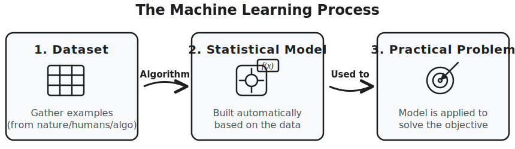

# Introduction

## Introduction
### What is Machine Learning
Machine Learning is a branch of computer science that builds algorithms to learn patterns from examples (data) and solve practical problems.

#### This process involves:

- Gathering a dataset of examples.

- Algorithmically building a statistical model based on that data.

- Using the model to solve the practical problem.

## Types of Learning

- Supervised Learning

- Unsupervised Learning

- Semi-Supervised Learning

- Reinforcement Learning

## Classification vs Regression
## Instance-Based vs Model-Based Learning
## Shallow vs Deep Learning
