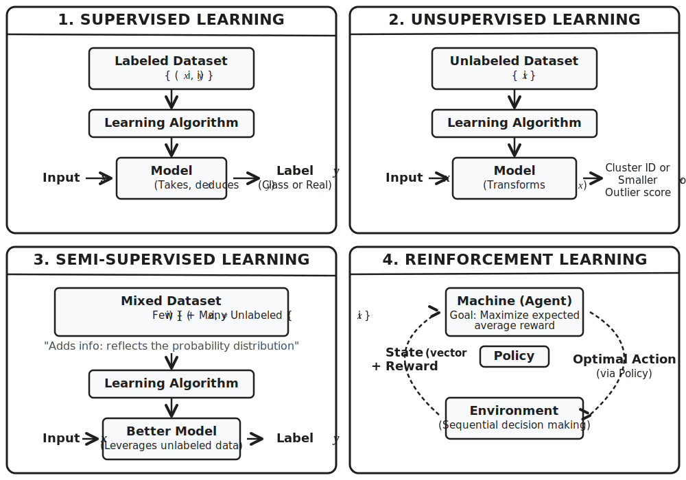
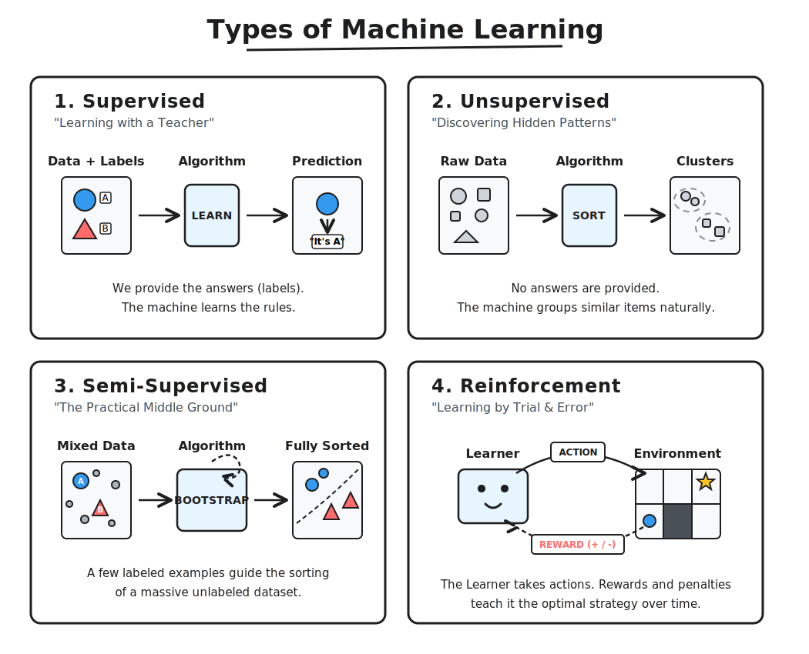

# Introduction

- Introduction
- What is Machine Learning
- Types of Learning

- Supervised Learning
- Unsupervised Learning
- Semi-Supervised Learning
- Reinforcement Learning

- Classification vs Regression
- Instance-Based vs Model-Based Learning
- Shallow vs Deep Learning
