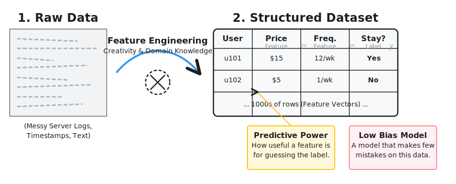

# Practice

- Basic Practice
- Feature Engineering

- One-Hot Encoding
- Binning
- Normalization
- Standardization
- Dealing With Missing Features
- Data Imputation Techniques
- Handling Imbalanced Datasets
- Algorithmic Efficiency
