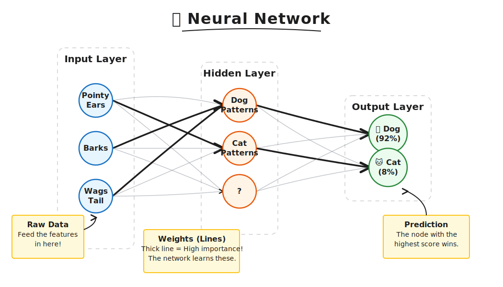
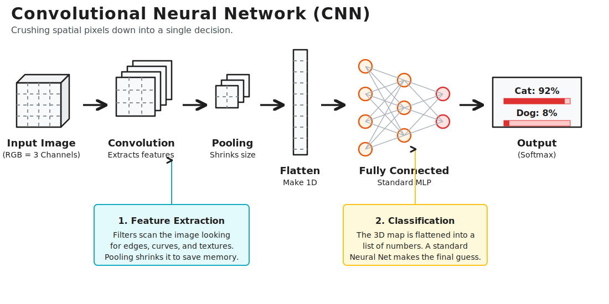

## Neural Networks

### Neural Networks

### Input Layer
This is where raw features enter the neural network.

Examples:
- Pointy Ears
- Barks
- Wags Tail

Each circle = one input value.

---

### Hidden Layer
The middle layer finds patterns from the inputs.

Examples:
- Dog Patterns
- Cat Patterns

It combines multiple inputs and learns relationships.

---

### Weights 
The lines between circles are called weights.

- Thick line = Strong influence
- Thin line = Weak influence

During training, the network adjusts these weights.

---

### Output Layer
Final prediction happens here.

Example:
- 🐶 Dog = 92%
- 🐱 Cat = 8%

Highest score wins.

---

### Learning Process
The network learns by:

1. Taking inputs  
2. Passing through hidden layers  
3. Making prediction  
4. Comparing with correct answer  
5. Updating weights  
6. Repeating many times

---

### Real Meaning
Instead of manually writing rules like:

- If barks → Dog  
- If meows → Cat

The neural network learns rules automatically from data.

---

Input → Pattern Detection → Prediction

### Multilayer Perceptron Example

- Feed-Forward Neural Network Architecture
- Deep Learning
- Training Neural Networks
- Transfer Learning
- Handling Multiple Inputs
- Handling Multiple Outputs

